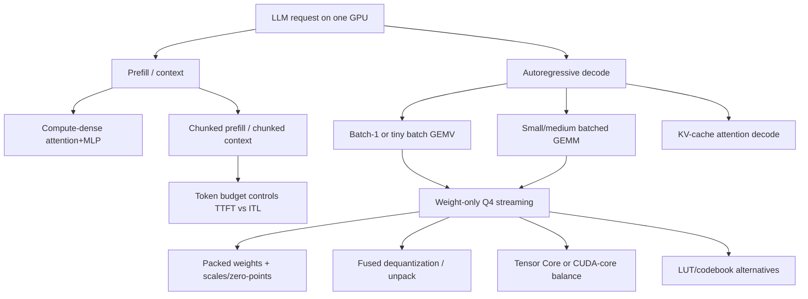

# Literature review: GPU kernel design for quantized LLM decode and prefill scheduling

Date: 2026-09-14  
Slug: `quantized-llm-decode-kernels`

## Executive summary

Autoregressive LLM serving has two very different phases. **Decode** repeatedly multiplies one newly generated token per active sequence through the model; at small batch sizes this is dominated by streaming model weights and KV-cache traffic rather than by peak floating-point compute. **Prefill** processes the input prompt with much higher arithmetic intensity and can saturate compute, but a long prefill can stall ongoing decode iterations if both share one GPU. This review therefore treats low-bit decode kernels and prefill scheduling as one coupled systems problem rather than as separate optimizations.

The strongest evidence is that Q4-style weight-only acceleration is not obtained by simply storing weights in 4 bits. Fast systems prepack weights and scales, fuse unpack/dequantization into the matmul main loop, align layouts with Tensor Core fragments, and choose different kernels for batch-1 GEMV, small-batch GEMM, and larger prefill/batched decode regimes. MARLIN is the clearest W4A16 GPU-kernel reference: it targets FP16/BF16 activations with INT4 weights for autoregressive inference, uses offline reshuffling plus fused dequantization/Tensor Core scheduling, and reports near-ideal 4-bit speedups through moderate batch sizes and up to 2.8x end-to-end speedup when integrated with vLLM [1][2].

A second line of work argues that W4A16 kernels still pay meaningful CUDA-core overhead for unpacking/dequantization. QServe instead uses a W4A8KV4 system design so the main GEMM path can use INT8 Tensor Cores, and it explicitly reports that prior INT4 methods can spend 20--90% runtime overhead dequantizing weights or partial sums on GPUs [3][4]. LUT/codebook methods such as SqueezeLLM and FLUTE attack a related problem for non-uniform or odd-bit quantization: replace scalar dequantization with table lookup plus carefully structured GEMM, but then the bottlenecks move to shared-memory lookup, bank conflicts, and offline layout constraints [5][6][7].

For prefill handling, the consensus is also architectural rather than purely kernel-level. Orca introduced iteration-level scheduling/selective batching for generation [8]. vLLM/PagedAttention made large continuous batches practical by reducing KV-cache fragmentation [9]. Sarathi-Serve, vLLM chunked prefill, DeepSpeed-FastGen Dynamic SplitFuse, and TensorRT-LLM chunked context all split prompt/context work into bounded chunks and co-schedule it with decode work so that prefill does not create long decode stalls [10][11][12][13][14]. On a single GPU, the principal exposed knob is a token/chunk budget: smaller chunks protect inter-token latency; larger chunks improve time-to-first-token and throughput [10][11].

No source in this review provides a universal best kernel or chunk size. Backend, GPU generation, quantization format, batch size, sequence-length distribution, and service-level objective all change the answer. A practical evaluation should therefore benchmark at least four regimes: batch-1 decode GEMV, small-batch decode GEMM, mixed prefill+decode with chunked prefill, and long-prompt prefill throughput.

## Taxonomy: where kernels and schedulers interact

### Decode kernel regimes

| Regime | Typical bottleneck | Kernel choice | Evidence |
|---|---:|---|---|
| Batch-1 decode / very small batch | Weight streaming and KV-cache traffic | GEMV-like or specialized small-batch kernels | AutoAWQ distinguishes GEMV for batch size 1 and GEMM for larger batch/context settings; BitBLAS exposes both GEMV and GEMM paths for mixed-precision LLM inference [15][16]. |
| Small-to-medium batched decode | Weight bandwidth plus dequantization/Tensor Core scheduling | W4A16 fused GEMM such as Marlin/Machete/CUTLASS-like kernels | MARLIN reports near-optimal speedups through batch sizes roughly 16--32; vLLM lists Marlin/Machete quantized backends with hardware-specific support [1][2][17][18]. |
| Larger batched decode / serving throughput | Compute begins to matter; dequant overhead may dominate | W4A8/W8A8 or backend-specific Tensor Core kernels | QServe argues W4A16/W4A4 can lose speed to CUDA-core dequantization and designs W4A8 to use INT8 Tensor Cores [3][4]. |
| Long-prompt prefill | Dense GEMM/attention compute and KV-cache allocation | High-throughput prefill kernels; scheduler chunking if mixed with decode | vLLM, Sarathi-Serve, TensorRT-LLM, and DeepSpeed-FastGen all expose chunked/split prompt work to prevent decode stalls [10][11][12][13][14]. |

## Weight-only Q4 decode: design patterns

### 1. Fusing dequantization is necessary but insufficient

W4A16 weight-only inference stores weights as INT4 while keeping activations in FP16/BF16. TensorRT-LLM describes W4A16/W8A16 as quantizing weights and dequantizing them on the fly in linear matmuls, including groupwise GPTQ/AWQ plugins with per-group scales and zero offsets [17]. The important kernel-design point is that a separate dequantize-then-GEMM pass would largely give back the memory savings through extra memory traffic and launch overhead. MARLIN instead incorporates unpacking/dequantization into the main loop and overlaps global/shared-memory movement with Tensor Core work [1][2].

This is also why format conversion matters. MARLIN's repository and paper emphasize prepacked/offline reshuffled weights and scales so that threads load the exact data needed for the Tensor Core fragment layout [1][2]. vLLM's Machete README similarly describes prepacking quantized weights for a CUTLASS-based Hopper-optimized mixed-precision GEMM path [18]. These layout choices are not cosmetic: if a runtime falls back to a generic dequantization path, the same GPTQ/AWQ checkpoint can have very different latency.

### 2. Group scales and zero-points are part of the hot loop

Most practical 4-bit LLM checkpoints use groupwise scales, and many use asymmetric zero-points. AutoAWQ's canonical configuration uses `w_bit=4`, `q_group_size=128`, and `zero_point=True`, with either GEMM or GEMV kernel variants [15]. TensorRT-LLM documents per-group scaling and zero-offset support in weight-only groupwise quantized matmul plugins [17].

The kernel implication is that scales/zero-points are not metadata accessed once per layer; they must be loaded, arranged, and sometimes transformed in the innermost tiling schedule. MARLIN addresses this with scale layout choices and vectorized scale loading [1][2]. QServe's W4A8 design goes further by moving some zero-point work out of the main loop when possible, or by using register-level/vectorized operations when per-group handling prevents that [3].

### 3. Memory-bound does not mean arithmetic is free

A common simplified claim is that decode is memory-bound, so 4-bit weights should be close to 4x faster. The reviewed papers qualify that claim. MARLIN's contribution is precisely that the reduced weight bandwidth can be translated into speedups only if dequantization and Tensor Core scheduling are hidden well enough [1]. QServe shows the failure mode: dequantization on CUDA cores can become a large fraction of runtime, reporting 20--90% overhead in prior INT4 methods [3]. CUTLASS Hopper mixed-dtype examples expose the same design pressure at the library level: INT4 mixed-dtype GEMMs rely on specific layouts, group-scale treatment, and in some cases LUTs or offline re-encoding [19][20].

### 4. Backend and GPU generation are first-class variables

vLLM lists multiple quantization backends, including Marlin and hardware-dependent support for GPTQ/AWQ/FP8/FP4-like methods [21]. TensorRT-LLM's quantization matrix likewise distinguishes precision modes and hardware support across NVIDIA generations [22]. The safe conclusion is not "Q4 is fast" but "Q4 can be fast when the checkpoint format, packing, backend, and GPU architecture match." Original MARLIN is an Ampere/Ada-oriented reference implementation; Machete and CUTLASS mixed-dtype kernels are more relevant for newer Hopper-style paths [1][18][19][20].

## LUT and codebook approaches

LUT methods are attractive when quantization is non-uniform, vector-quantized, or uses odd bit widths. SqueezeLLM implements non-uniform 3/4-bit quantization with CUDA lookup-table matvec kernels for compressed weights and FP16 activations [5]. FLUTE generalizes this idea to lookup-table-quantized LLM GEMM: it uses offline matrix restructuring, vectorized shared-memory LUT operations, LUT duplication to reduce bank conflicts, Tensor Core MMA, and Stream-K-style partitioning; it reports 2--4x kernel speedups at small batch sizes in its evaluated setting [6][7].

The disagreement is about where the complexity should live. MARLIN-style kernels keep a simple affine quantization model but invest heavily in packed layout and fused dequantization [1][2]. LUT kernels can represent non-uniform/codebook quantizers more naturally, but they introduce lookup traffic, shared-memory pressure, and table-layout constraints [6][7]. NVIDIA CUTLASS's INT4 x FP8 example is a useful bridge: it uses a lookup table to avoid direct INT4-FP8 multiplication, but requires offline INT4/scale re-encoding and has documented limitations [20]. The emerging hardware direction is also relevant: NVIDIA PTX documentation lists Blackwell-era `tcgen05.mma` LUT-decompression qualifiers, suggesting that some LUT/decompression patterns are becoming hardware-visible rather than purely software-emulated [23].

## Prefill-decode interference and chunked prefill

### Scheduling lineage

Orca is the baseline systems source for iteration-level scheduling: requests can enter/leave between model iterations instead of being batched for a whole request lifetime, and selective batching handles different operators differently [8]. vLLM/PagedAttention focuses on the KV-memory bottleneck, using paged KV-cache management to reduce fragmentation and enable more concurrent sequences [9]. These systems improve concurrency, but long prefills can still create latency spikes for active decodes.

Sarathi-Serve directly frames the interference: decode is low-utilization/memory-bound and runs one token per sequence; prefill is compute-dense and variable length. Its scheduler splits prefills into chunks, schedules ongoing decodes first, then adds ongoing/new prefill chunks within a token budget to create stall-free hybrid batches [10]. The OSDI paper reports up to 2.6x higher serving capacity than vLLM for Mistral-7B on a single A100 under its evaluated tail-latency constraints [10].

### Production-facing variants

Current vLLM documentation states that chunked prefill is enabled whenever possible in V1, prioritizes decodes before prefills, and uses `max_num_batched_tokens` as the key tradeoff knob: smaller values improve inter-token latency, while larger values improve time-to-first-token and throughput [11]. TensorRT-LLM calls the analogous feature chunked context, which divides input tokens into chunks and batches them with decode requests; it also documents scheduling policies such as first-come-first-served and equal-progress [13][14]. DeepSpeed-FastGen's Dynamic SplitFuse similarly decomposes long prompts and composes prompt/generation tokens to stabilize forward-pass size [12].

SGLang exposes chunked-prefill knobs, but its exact semantics should be cited carefully. Official docs describe `--chunked-prefill-size` and prefill token budgets, while issues/PRs discuss confusing or evolving semantics around whether the knob behaves as a per-request or batch-wide budget [24][25][26]. FlashInfer is best treated as kernel/API grounding rather than a scheduler paper: it exposes separate batch prefill and batch decode attention wrappers for paged/ragged KV caches, which supports the general point that scheduling choices interact with attention backend selection [27].

## Consensus, disagreements, and gaps

### Consensus

1. **Decode acceleration is a memory-traffic problem first, but dequantization can become the limiter.** MARLIN and QServe agree that low-bit storage must be paired with kernel-level fusion/layout work; QServe provides the strongest explicit warning about dequantization overhead [1][3].
2. **Q4 checkpoint format is not enough to predict performance.** Kernel backend, group size, zero-point mode, packing, and GPU architecture determine whether a model routes to Marlin, Machete, TensorRT-LLM, BitBLAS, ExLlama-like kernels, or a slower fallback [15][17][18][21][22].
3. **LUT/codebook kernels are credible but specialized.** SqueezeLLM and FLUTE show that lookup-table quantization can be fast, but their advantages depend on batch regime, table layout, and quantizer type [5][6][7].
4. **Chunked prefill is the dominant single-GPU scheduling answer to prefill-decode interference.** Sarathi-Serve, vLLM, TensorRT-LLM, and DeepSpeed-FastGen converge on splitting context/prompt work into bounded chunks and mixing it with decode [10][11][12][13].

### Disagreements or unresolved choices

- **W4A16 vs W4A8:** W4A16 is simpler and widely supported for GPTQ/AWQ-style checkpoints, while QServe argues that W4A8 better exploits INT8 Tensor Cores and reduces dequantization penalty in cloud serving [3][17]. This is a workload/backend choice, not a settled universal answer.
- **GEMV vs GEMM thresholds:** Docs such as AutoAWQ provide broad guidance that GEMV is for batch size 1 and GEMM for larger batches [15], but exact crossover points depend on model dimensions, GPU, backend, and scheduler-created batch shapes.
- **Chunk size defaults:** Sources agree on tradeoff direction but not on a universal value. vLLM exposes `max_num_batched_tokens`; TensorRT-LLM exposes chunked-context policies; Sarathi-Serve computes a token budget from SLO and profiling [10][11][13][14].
- **Current-version behavior:** vLLM, TensorRT-LLM, SGLang, FlashInfer, and CUTLASS are fast-moving. Exact defaults, kernel selection, and hardware support should be rechecked against pinned versions before production decisions [21][22][24][25].

## Recommended experiments

No experiment was run in this review. The minimal reproducible experiment set for a practitioner would be:

1. **Kernel microbenchmarks:** benchmark FP16, W4A16 Marlin/Machete/TensorRT, and if available W4A8/QServe-like kernels on the target GPU for M=N/K shapes matching the chosen model. Report achieved bandwidth, achieved Tensor Core utilization if available, and latency vs batch size.
2. **GEMV/GEMM crossover:** for batch sizes 1, 2, 4, 8, 16, 32, measure prepacked GEMV and GEMM paths with the same quantized checkpoint, group size, zero-point mode, and activation dtype.
3. **Mixed prefill+decode serving trace:** run a trace with long prompts plus active decodes while sweeping chunk/token budget. Record TTFT, ITL/TPOT, P95/P99 latency, throughput, and preemption events.
4. **Backend-selection audit:** log which kernel backend actually executes for each layer. This catches silent fallbacks where the checkpoint is quantized but not accelerated.
5. **LUT comparison only when using non-uniform/codebook quantization:** compare FLUTE/SqueezeLLM-like kernels against affine W4A16 for the same perplexity/accuracy target, not just raw speed.

## Evidence table

| Source | What it supports | Limitation |
|---|---|---|
| MARLIN, 2024, arXiv:2408.11743 [1] | W4A16 autoregressive kernel design; fused dequantization, offline layout, Tensor Core scheduling, vLLM integration | Source-reported performance; implementation/hardware specific |
| IST-DASLab Marlin repo [2] | Implementation details and kernel artifact | Repo docs may lag framework integrations |
| QServe, 2024/2025, arXiv:2405.04532 [3] | Dequantization overhead and W4A8KV4 system/kernel co-design | W4A8KV4, not pure W4A16; comparisons may age with TensorRT/vLLM updates |
| OmniServe/QServe repo [4] | Released fused W4A8/KV4 kernel code path | Repo status/version should be checked before reproduction |
| SqueezeLLM, 2023, arXiv:2306.07629 [5] | LUT-based non-uniform 3/4-bit decode-style matvec | Less relevant for batched Tensor Core GEMM |
| FLUTE, 2024, arXiv:2407.10960 / ACL [6][7] | LUT-quantized GEMM design and small-batch speedups | Strongest for its tested batch/group settings |
| Orca, OSDI 2022 [8] | Iteration-level scheduling/selective batching baseline | Distributed serving paper, not quantized-kernel work |
| vLLM/PagedAttention, SOSP 2023/arXiv:2309.06180 [9] | KV-cache paging and continuous-batching memory foundation | Does not by itself solve chunked prefill policy |
| Sarathi-Serve, OSDI 2024/arXiv:2403.02310 [10] | Chunked prefill, stall-free batching, token budget, single-A100 result | Research prototype; workload/SLO dependent |
| vLLM docs [11][21] | Current chunked-prefill policy and quantization backend matrix | Docs/version dependent |
| TensorRT-LLM docs [13][14][17][22] | Weight-only dequantization, groupwise plugins, chunked context, hardware support | Exact runtime behavior depends on release/build |
| DeepSpeed-FastGen [12] | Independent split/fuse prompt-generation scheduling pattern | Vendor system; compare against current baselines carefully |
| SGLang docs/issues [24][25][26] | Practical chunked-prefill knobs and caveats | Semantics are version-sensitive |
| FlashInfer docs [27] | Separate prefill/decode attention APIs | Kernel/API source, not scheduler evidence |

## Sources

[1] Elias Frantar et al. "MARLIN: Mixed-Precision Auto-Regressive Parallel Inference on Large Language Models" (2024), arXiv:2408.11743. https://arxiv.org/abs/2408.11743  
[2] IST-DASLab, `marlin` repository. https://github.com/IST-DASLab/marlin  
[3] Yujun Lin, Haotian Tang, Shang Yang et al. "QServe: W4A8KV4 Quantization and System Co-design for Efficient LLM Serving" (2024/2025), arXiv:2405.04532. https://arxiv.org/abs/2405.04532  
[4] MIT Han Lab, `omniserve` / QServe implementation. https://github.com/mit-han-lab/omniserve  
[5] Sehoon Kim et al. "SqueezeLLM: Dense-and-Sparse Quantization" (2023), arXiv:2306.07629. https://arxiv.org/abs/2306.07629  
[6] Han Guo et al. "Fast Matrix Multiplications for Lookup Table-Quantized LLMs" (Findings of EMNLP 2024), arXiv:2407.10960. https://arxiv.org/abs/2407.10960  
[7] ACL Anthology record for "Fast Matrix Multiplications for Lookup Table-Quantized LLMs." https://aclanthology.org/2024.findings-emnlp.724/  
[8] Gyeong-In Yu et al. "Orca: A Distributed Serving System for Transformer-Based Generative Models" (OSDI 2022). https://www.usenix.org/system/files/osdi22-yu.pdf  
[9] Woosuk Kwon et al. "Efficient Memory Management for Large Language Model Serving with PagedAttention" (SOSP 2023), arXiv:2309.06180. https://arxiv.org/abs/2309.06180  
[10] Amey Agrawal et al. "Taming Throughput-Latency Tradeoff in LLM Inference with Sarathi-Serve" (OSDI 2024), arXiv:2403.02310. https://arxiv.org/abs/2403.02310  
[11] vLLM documentation, "Optimization and Tuning" / chunked prefill. https://docs.vllm.ai/en/stable/configuration/optimization/  
[12] Michael Holmes et al. "DeepSpeed-FastGen: High-throughput Text Generation for LLMs via MII and DeepSpeed-Inference" (2024), arXiv:2401.08671. https://arxiv.org/abs/2401.08671  
[13] TensorRT-LLM documentation, "Long Sequence" / chunked context. https://github.com/NVIDIA/TensorRT-LLM/blob/main/docs/source/features/long-sequence.md  
[14] TensorRT-LLM documentation, runtime flags / context chunking policy. https://nvidia.github.io/TensorRT-LLM/performance/performance-tuning-guide/useful-runtime-flags.html  
[15] AutoAWQ README. https://github.com/casper-hansen/AutoAWQ/blob/main/README.md  
[16] Microsoft BitBLAS repository. https://github.com/microsoft/BitBLAS  
[17] TensorRT-LLM numerical precision reference. https://nvidia.github.io/TensorRT-LLM/reference/precision.html  
[18] vLLM Machete README. https://github.com/vllm-project/vllm/blob/main/csrc/libtorch_stable/quantization/machete/Readme.md  
[19] NVIDIA CUTLASS Hopper INT4 x BF16 mixed dtype GEMM example. https://github.com/NVIDIA/cutlass/blob/main/examples/55_hopper_mixed_dtype_gemm/55_hopper_int4_bf16_gemm.cu  
[20] NVIDIA CUTLASS Hopper INT4 x FP8 mixed dtype GEMM example. https://github.com/NVIDIA/cutlass/blob/main/examples/55_hopper_mixed_dtype_gemm/55_hopper_int4_fp8_gemm.cu  
[21] vLLM quantization documentation. https://docs.vllm.ai/en/stable/features/quantization/  
[22] TensorRT-LLM quantization feature docs. https://github.com/NVIDIA/TensorRT-LLM/blob/main/docs/source/features/quantization.md  
[23] NVIDIA PTX ISA documentation, matrix instructions. https://docs.nvidia.com/cuda/parallel-thread-execution/index.html#warp-level-matrix-instructions-mma  
[24] SGLang server arguments. https://docs.sglang.ai/advanced_features/server_arguments.html  
[25] SGLang issue #20018, chunked prefill semantics. https://github.com/sgl-project/sglang/issues/20018  
[26] SGLang PR #35414, chunked prefill docs clarification. https://github.com/sgl-project/sglang/pull/35414  
[27] FlashInfer attention kernel API docs. https://docs.flashinfer.ai/api/attention.html
